# Monitoramento com Zabbix

## 📌 Visão Geral

Este projeto apresenta um **laboratório completo de monitoramento de infraestrutura** utilizando o Zabbix, uma solução open-source de monitoramento amplamente utilizada no mercado para infraestrutura, servidores e serviços de TI. :contentReference[oaicite:0]{index=0}

O laboratório foi construído com foco em **coleta de métricas, triggers, alertas e dashboards**, simulando um ambiente corporativo real. O Zabbix Server foi instalado em um **Ubuntu Server**, monitorando hosts Linux e Windows executando em **VirtualBox**.

---

## 🎯 Objetivos do Projeto

- Implementar um servidor de monitoramento centralizado.
- Monitorar hosts **Linux** e **Windows** via **Zabbix Agent**.
- Configurar **itens, triggers, alertas e dashboards**.
- Simular um ambiente corporativo virtualizado.
- Consolidar conhecimentos em infraestrutura, redes e Linux.

---

## 🧱 Arquitetura do Ambiente

### Topologia Lógica

O ambiente foi montado com os seguintes componentes:

- **Zabbix Server** executando em Ubuntu Server.
- **Hosts monitorados**:
  - Ubuntu Server (com Zabbix Agent instalado).
  - Windows Server (com Zabbix Agent instalado).
- **Hypervisor**: Oracle VirtualBox.

A comunicação entre o servidor e os agentes é realizada via protocolos e portas padrão do Zabbix (TCP 10050/10051).

---

## 📦 Tecnologias Utilizadas

- **Zabbix Server** e **Zabbix Agent**
- **Ubuntu Server**
- **Windows Server**
- **Oracle VirtualBox**
- **SSH** para administração de hosts
- **Banco de dados** (MySQL/MariaDB quando aplicável)

---

## ⚙️ Configuração do Ambiente

### Preparação das Máquinas

As máquinas virtuais foram criadas no VirtualBox com as seguintes finalidades:

   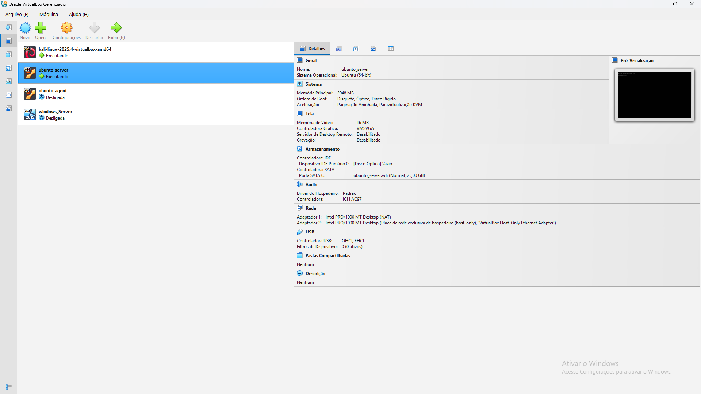

- Definição de rede adequada (Host-only ou NAT + Host-only).
- Endereçamento IP estático para comunicação confiável.
- Atualização dos sistemas operacionais.
- Configuração de hostname em todas as VMs.

---

## 🧩 Instalação do Zabbix Server

1. Adição do repositório oficial do Zabbix:

   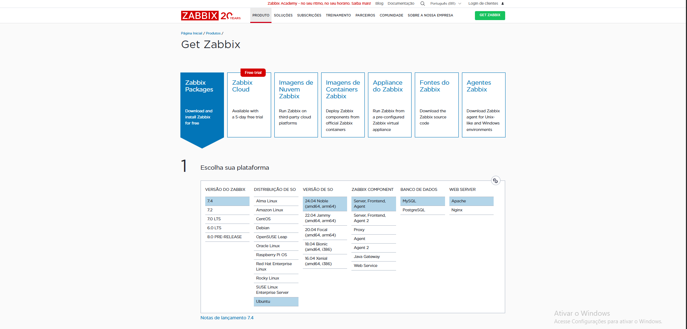

2. Instalação dos pacotes do Zabbix Server e frontend web.

3. Configuração do banco de dados e ajustes em `zabbix_server.conf`.

4. Inicialização e validação dos serviços do Zabbix:

   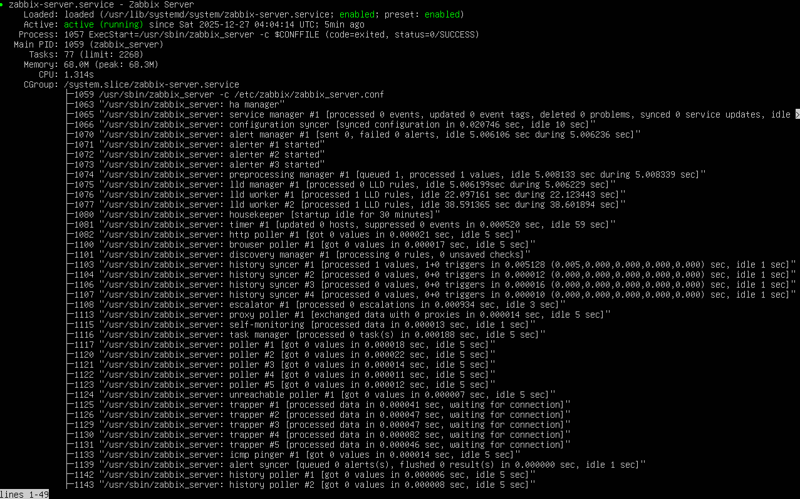

5. Acesso ao dashboard pela interface web:

   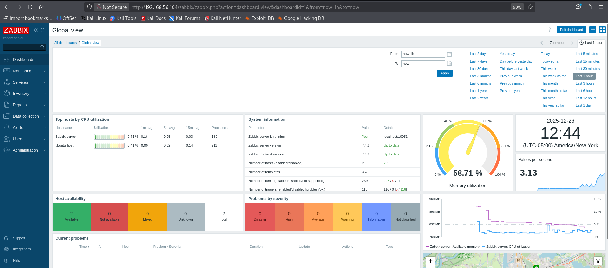

---

## 🐧 Instalação do Zabbix Agent – Linux

1. Instalação do agente no Ubuntu Server:

   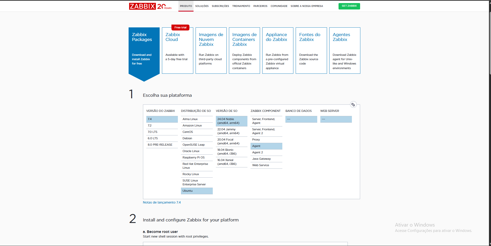

2. Configuração do arquivo `zabbix_agentd.conf` com os parâmetros `Server` e `ServerActive`:

   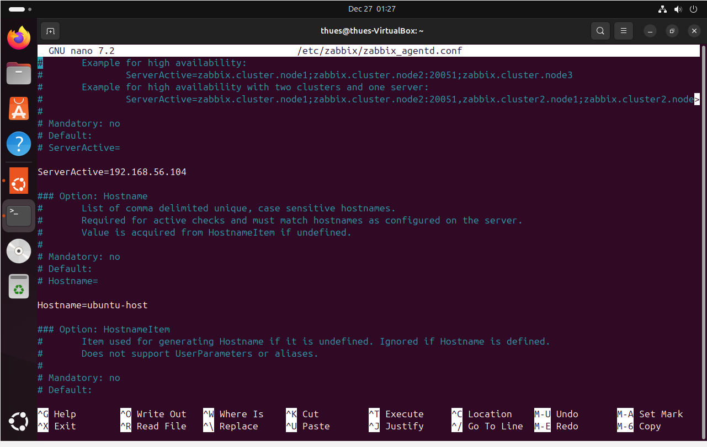

3. Inicialização e validação:

   

4. Verificação de comunicação com o Zabbix Server.

---

## 📊 Monitoramentos Implementados

Esses foram os itens básicos implementados:

   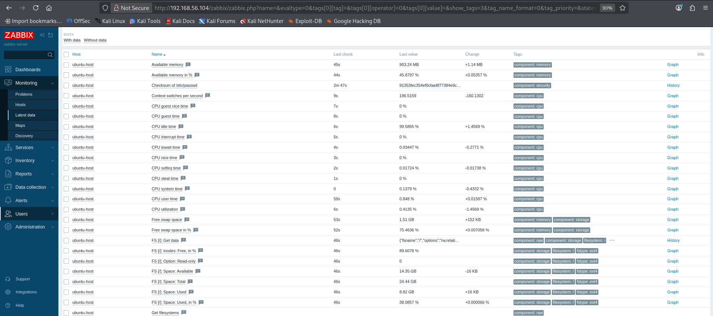

- Uso de CPU
- Uso de memória RAM
- Espaço em disco
- Disponibilidade de host (ICMP)
- Status do Zabbix Agent

---

## 🚨 Configuração de Triggers e Alertas

### Trigger: Uso de CPU acima de 80% por 5 minutos

   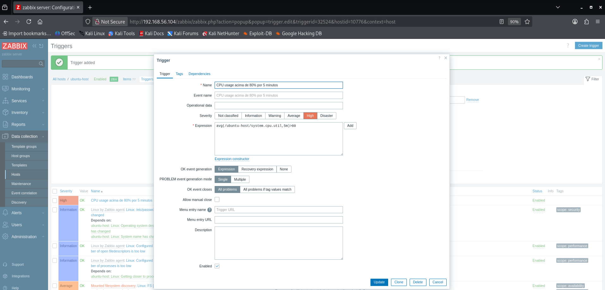

Essa trigger foi criada para detectar sobrecarga contínua de CPU e evitar falsos positivos gerados por picos momentâneos.

- **Objetivo:** identificar quando o host está sob carga alta por um período contínuo, indicando necessidade de ação.
- **Expressão:** média da utilização da CPU nos últimos 5 minutos > 80%.

#### Fases do teste

#### CPU normal antes do teste

   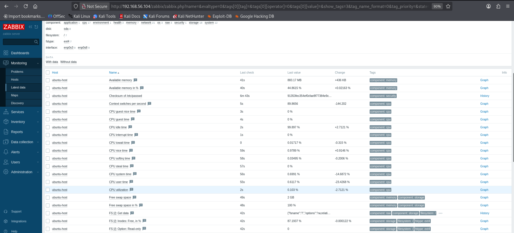

#### Execução de carga alta

   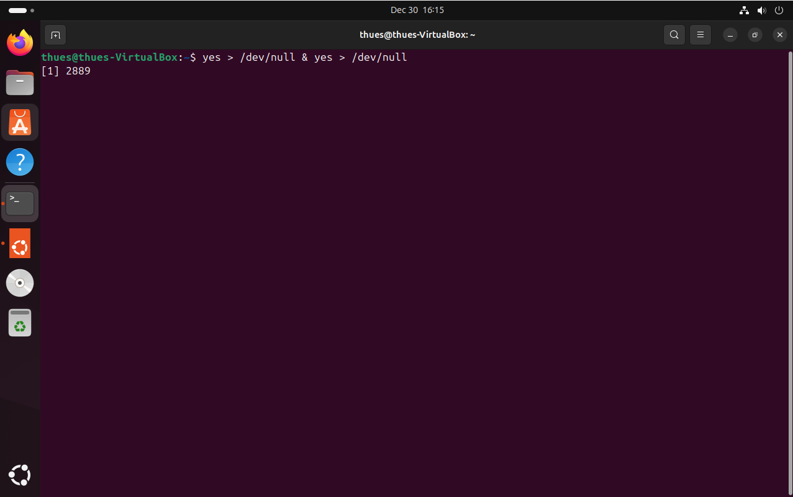

#### Trigger disparada

   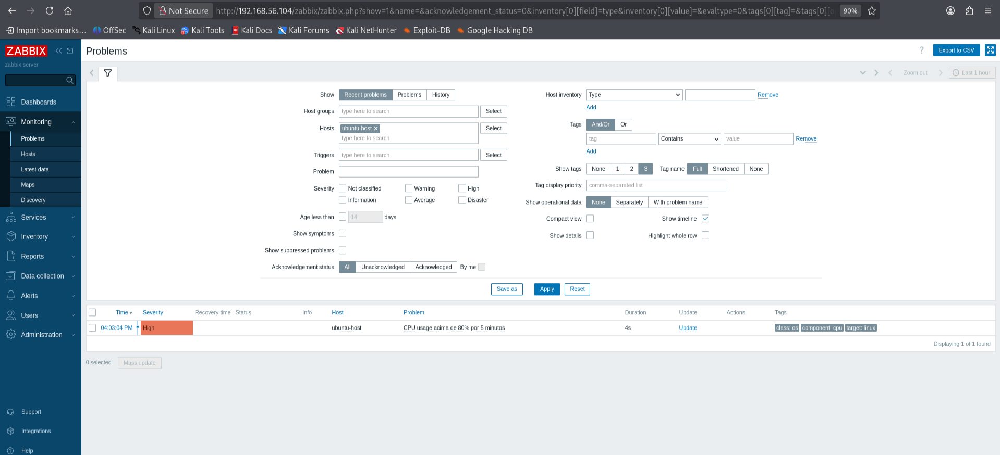

## 🧠 Aprendizados

Durante a execução do projeto, foram desenvolvidas diversas habilidades práticas:

- Instalação e configuração completa do Zabbix.
- Monitoramento de ambientes heterogêneos (Linux/Windows).
- Configuração de triggers e alertas.
- Importância do monitoramento proativo para mitigação de falhas.
- Troubleshooting de conectividade e agentes.
- Organização de documentação técnica.

---

## 📌 Próximos Passos

Possíveis evoluções do projeto:

- Criação de **dashboards personalizados** 
- Monitoramento adicional por **SNMP**.
- Integração de alertas por **e-mail ou Telegram**.
- Refinamento da documentação como **portfólio profissional**.

---

## 👤 Autor

- **Nome:** Matheus Lima  
- **GitHub:** https://github.com/the-matheuslima  
- **LinkedIn:** https://www.linkedin.com/in/the-matheuslima/

---

## 📄 Licença

Projeto de caráter educacional, com uso livre para fins de estudo e aprendizado.
